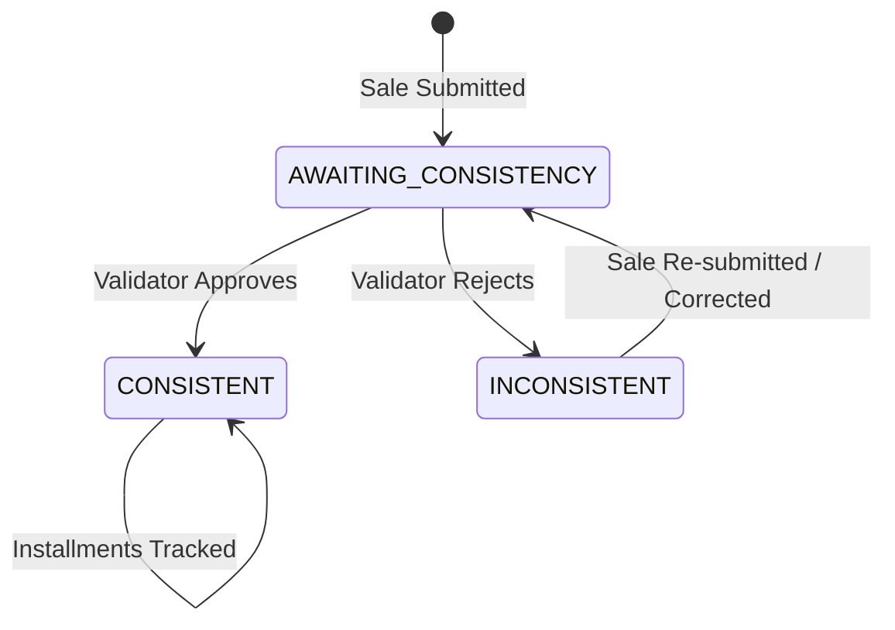

# Sales Consistency Module — Architecture Overview

## Purpose

This module replaces external tools (referred to as "Auto") for sale submission and validation. It introduces:

1. **Sale Submission Flow** — Salespeople input sales directly into the CRM. Sales start with status `AWAITING_CONSISTENCY`.
2. **Validator Dashboard** — A dedicated view for Managers/Admins (personas like "Stephanie") to review and mark sales as `CONSISTENT` or `INCONSISTENT`.
3. **Installment Tracking** — Explicit tracking of the first 4 installment payments (status + receipt date for each).

---

## State Machine

### Status Definitions

| Status | Label (PT-BR) | Description |
|--------|---------------|-------------|
| `AWAITING_CONSISTENCY` | Aguardando Consistência | Sale submitted by salesperson, pending validation |
| `CONSISTENT` | Consistente (Aprovada) | Validated by Manager/Admin — data is correct |
| `INCONSISTENT` | Inconsistente (Rejeitada) | Rejected by Manager/Admin — data mismatch found |

---

## Installment Tracking Model

Each sale tracks **4 installments** individually:

| Field | Type | Description |
|-------|------|-------------|
| `installment_N_status` | `PENDING` / `RECEIVED` / `OVERDUE` | Status of the Nth installment |
| `installment_N_due_date` | `DATETIME` | Due date for the Nth installment |
| `installment_N_received_date` | `DATETIME` (nullable) | Actual receipt date (null until received) |
| `installment_N_value` | `REAL` | Value of the Nth installment |

Where `N` = 1, 2, 3, 4.

---

## System Integration Points

### Existing System Mapping

| Layer | Existing Pattern | New Module Pattern |
|-------|------------------|--------------------|
| **Database** | `deals` table, inline CREATE in `client.ts` | New `sales` table, ALTER via migration script |
| **Types (DB)** | `src/types/db/index.ts` (snake_case) | Add `Sale` interface |
| **Types (Frontend)** | `src/types/index.ts` (camelCase) | Add `Sale`, `SaleConsistencyStatus`, `InstallmentStatus` |
| **Operations** | `src/lib/db/operations.ts` | Add sale CRUD + validation + installment ops |
| **API Routes** | `src/app/api/db/deals/route.ts` | New `src/app/api/db/sales/route.ts` + `sales/[id]/validate/route.ts` + `sales/[id]/installments/route.ts` |
| **Services** | `src/services/api.ts` — `dealsApi` | Add `salesApi` |
| **Context** | `CRMContext.tsx` — React Query mutations | Add sales queries/mutations |
| **Components** | `KanbanBoard.tsx`, `DealForm.tsx`, `Modal.tsx` | New `ValidatorDashboard.tsx`, `SaleSubmissionForm.tsx`, `InstallmentGrid.tsx`, `ValidationModal.tsx` |
| **Page** | `page.tsx` — `View` type union | Add `'sales_validation'` view |

### RBAC Permissions

| Action | ADMIN | MANAGER | SALES_REP | SUPPORT |
|--------|-------|---------|-----------|---------|
| Submit Sale | ✅ | ✅ | ✅ | ❌ |
| View Validator Dashboard | ✅ | ✅ | ❌ | ❌ |
| Mark Consistent/Inconsistent | ✅ | ✅ | ❌ | ❌ |
| View Own Sales | ✅ | ✅ | ✅ | ✅ |
| Update Installment Status | ✅ | ✅ | ❌ | ❌ |
| View All Sales (any seller) | ✅ | ✅ | ❌ | ❌ |

---

## File Deliverables

| Step | Document | Description |
|------|----------|-------------|
| 01 | `01-DATABASE.md` | Migration SQL scripts |
| 02 | `02-TYPES.md` | TypeScript type definitions |
| 03 | `03-BACKEND-OPERATIONS.md` | DB operation functions |
| 04 | `04-API-ROUTES.md` | REST API endpoints |
| 05 | `05-SERVICES.md` | Frontend API client |
| 06 | `06-COMPONENTS.md` | UI component specs |
| 07 | `07-CONTEXT-INTEGRATION.md` | CRM context wiring |
| 08 | `08-PAGE-INTEGRATION.md` | Navigation & page integration |
| 09 | `09-VERIFICATION.md` | Testing plan |
